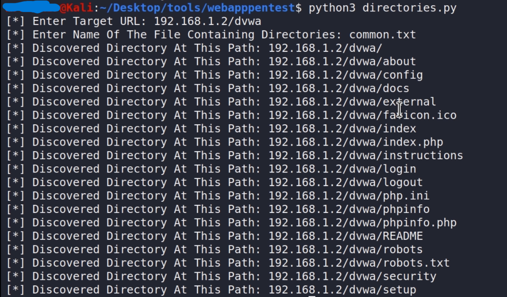

# Search Directories Tool

A powerful tool designed to assist security professionals and ethical hackers in identifying **important vulnerable files** on web servers. This Python-based tool helps discover hidden files and directories that might pose security risks, allowing for efficient security assessments.

## 📘 Introduction
The **Search Directories Tool** is a Python script that helps in discovering hidden or important directories and files that might be vulnerable to exploitation. It uses a customizable wordlist to scan the target URL for common and uncommon directory names, potentially exposing sensitive files.

**Use responsibly** and only on systems that you have explicit permission to test.

## ✨ Features
- **Customizable Wordlist**: Choose or create your own wordlist to search for potential vulnerabilities.
- **Fast and Efficient**: Quickly search through URLs to identify hidden or vulnerable files.
- **Easy Integration**: Can be easily integrated into larger security testing tools or workflows.
- **User-Friendly**: Command-line interface that is simple to configure and run.

## 🚀 Installation
To use the Search Directories Tool, you’ll need to clone the repository and install the required dependencies.

1. Clone the repository and navigate into the project folder.
2. Install the required dependencies listed in the `requirements.txt` file.

## 🛠️ Usage
```bash
cd directories
python3 directories.py
```

### Search Directories Tool
To search for vulnerable directories or files, run the script with the following parameters:

- **URL**: The target URL (base URL of the web application you want to test).
- **WORDLIST**: Path to the wordlist file that contains potential directory names.

The tool will start the search process, scanning the specified URL for potential vulnerable directories and files based on the provided wordlist.

## 📊 Example Output
Here’s an example of what the output might look like:

### Screenshot of the Tool in Action:


